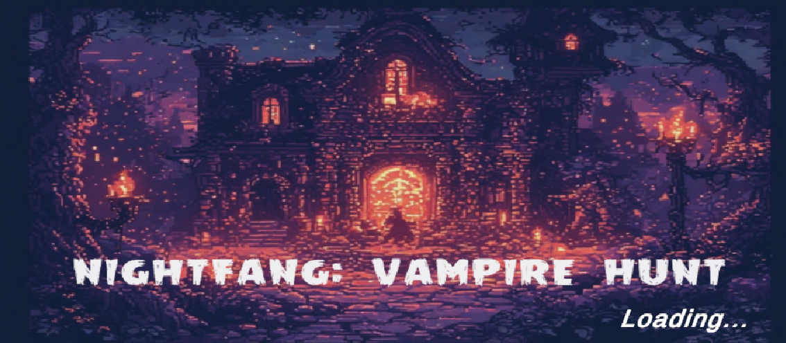
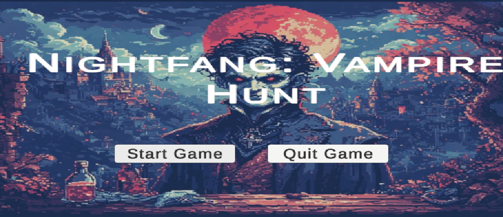

# 🧛 Nightfang: Vampire Hunt

**Nightfang: Vampire Hunt** is a simple 2D top-down game made with **Unity**.  
You play as a vampire hunter tasked with collecting gems and eliminating vampires in a haunted mansion.

This repository only includes the **Assets** folder from the Unity project (no `ProjectSettings`, `Library`, or build files).

---

## 🎮 Gameplay

- 🔪 Defeat vampires
- 💎 Collect gems scattered around the map
- ❤️ Stay alive with a simple health system
- 👻 Explore a spooky environment

---

## 📁 What's Included

- `Assets/`:
  - Sprites, prefabs, audio, and scripts
  - No project settings or builds included

---

## 🖼️ Screenshots

---

## 🎥 Gameplay Video

[▶️ Watch Gameplay Video](
https://github.com/user-attachments/assets/c3cfc678-1e9f-4f3f-87a4-9ea1ddcaee52)

---

## 🎨 Assets & Credits

All assets were sourced from free platforms:

- **Environment**:  
  [Spooky Mansion Pack](https://chippotato.itch.io/spooky-mansion-pack) – chippotato (itch.io)

- **Player Character**:  
  [Apocalypse](https://cuddle-bug.itch.io/apocalypse) – cuddle-bug (itch.io)

- **Vampire Enemies**:  
  [4-Direction Vampire Sprite Pack](https://free-game-assets.itch.io/free-vampire-4-direction-pixel-character-sprite-pack) – Free Game Assets (itch.io)

- **Health System**:  
  [Health System for Dummies](https://assetstore.unity.com/packages/tools/utilities/health-system-for-dummies-215755) – Unity Asset Store

- **Gems**:  
  [Sunny Land Pack](https://assetstore.unity.com/packages/2d/characters/sunny-land-103349) – Unity Asset Store

- **Audio**:  
  Free sounds and music from [Pixabay.com](https://pixabay.com)

---

## ✅ License

This project is shared for **educational and non-commercial** purposes.  
Please credit the original creators if reusing any assets.

---

## 🙏 Thanks

Special thanks to all the amazing creators who made these free assets available for indie devs.
